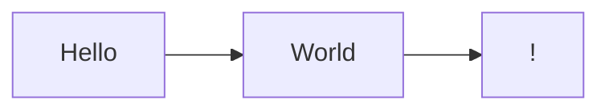

# Mermaid-Markdown-Docs

Mermaid-Markdown-Docs is a framework to easily create documentation websites from markdown files, with minimal setup.

## Built-in features:

* Create a documentation website entirely from markdown files
* Built-in support for [Mermaid diagrams](https://mermaid.js.org/)
* Built-in search functionality using [Lunr.js](https://lunrjs.com/)
* Development server with automatic reloading when changes are detected
* Fast build speeds thanks to running on esbuild
* Independent output bundle, it is just html and js, it can run anywhere!

# Installation

The package `mermaid-markdown-docs` can be installed from npm using the following command:

```
npm i -D mermaid-markdown-docs
```

# Getting started
After installing the package, create a directory called `docs`. Create your first markdown file `my-first-page.md` in it:
````
---
title: MyFirstPage
---
# My First page

My first mermaid diagram:


````

Run `mermaid-markdown-docs start` to start the development server:
```
npx mermaid-markdown-docs start
```

Once you are happy with the output run `mermaid-markdown-docs build` to create a final build of website in the `out` directory:
```
npx mermaid-markdown-docs build
```
