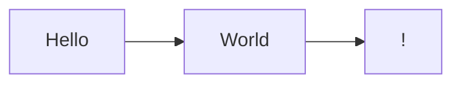

# Installation

The package `mermaid-markdown-docs` can be installed from npm using the following command:

```shell
$ npm i -D mermaid-markdown-docs
```

# Getting started
After installing the package, create a directory called `docs`. Create your first markdown file `my-first-page.md`, in it put the following code:
````
---
title: My First Page
---

My first page with my first mermaid diagram:


````

## Running the development server

The built-in development server lets you see your documentation website locally. It listens to changes in your files and automatically reloads when you change your documentation.

Run `mermaid-markdown-docs serve` to start the development server:
```shell
$ npx mermaid-markdown-docs serve
```

## Building final output

Once you are happy with the output run `mermaid-markdown-docs build` to create a final build of website in the `out` directory:
```shell
$ npx mermaid-markdown-docs build
```