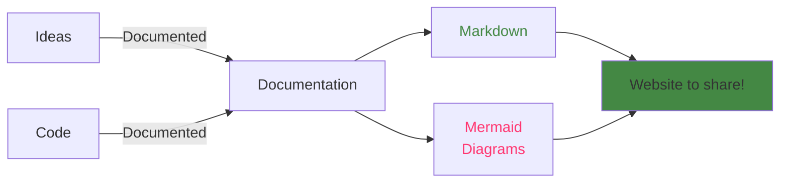

Mermaid-Markdown-Docs is a framework to easily create documentation websites from markdown files, with minimal setup. Keep your documentation up-to-date next to your code, and generate useful websites and visualisations to share!

This documentation website is generated using [Mermaid-Markdown-Docs](https://github.com/Perryvw/mermaid-markdown-docs).

## Built-in features:

-   Documentation websites can be generated entirely from markdown files.
-   Built-in support for [Mermaid diagrams](https://mermaid.js.org/)
-   Built-in search functionality using [Lunr.js](https://lunrjs.com/)
-   Development server with automatic reloading when changes are detected
-   Fast build speeds thanks to running on esbuild
-   Independent output bundle, it is just html and js, it can run anywhere!

