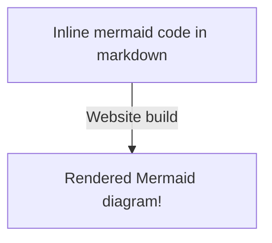

[Mermaid diagrams](https://mermaid.js.org/intro/) are supported by default. There are two ways to include them:

### Inline diagrams

Simply add a codeblock in your Markdown with the `mermaid` type. This codeblock will then be replaced with a rendered diagram in the generated website:

````

````


### Reference external diagram files

You can also separate your diagrams from your markdown for organizational reasons. This file **must** have a `.mmd` extension.

For example we make a file `external-mermaid.mmd`. We can then include it in a page by simply writing:

```

```

